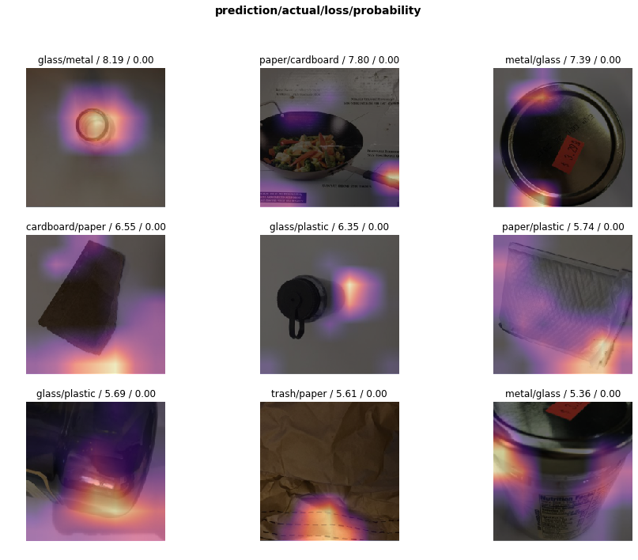
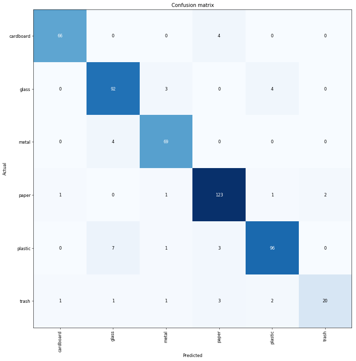

> This project was submitted under IE 532 Technoproneurship Class at Batangas State University.

## Problem
Despite strong environmental activism among Filipinos, the
Philippines still suffers from trash problems. The Philippines generates an estimated 43,684 tons of garbage daily,
including 4,609 tons of plastic waste, according to government data, and proper disposal facilities are lacking for
much of it

## Solution
A trashcan which sorts garbage using a custom-trained **convolutional neural network (CNN)** model according to the following classifications:
- cardboards
- glass
- metals
- papers
- plastics
- trash

## Convolutional Neural Network
A Convolutional Neural Network (ConvNet/CNN) is a Deep Learning algorithm which can take in an input image, assign importance (learnable weights and biases) to various aspects/objects in the image and be able to differentiate one from the other. The pre-processing required in a ConvNet is much lower as compared to other classification algorithms. While in primitive methods filters are hand-engineered, with enough training, ConvNets have the ability to learn these filters/characteristics.
[Source: towardsdatascience.com](https://towardsdatascience.com/a-comprehensive-guide-to-convolutional-neural-networks-the-eli5-way-3bd2b1164a53)

## Dataset
> To train our model, we've used [Garythung's Trashnet Dataset](https://github.com/garythung/trashnet)

The data set contains about 501 glass bottle, 594 paper, 403 cardboard, 482 plastic, 410 metal, 137 trash images

## Training Result (Prediction Loss)

Looking at the third highest loss, the model detects the metal lid as ***metal*** however, due to the mislabeling of garythung's trashnet dataset which labelled the image as ***glass*** when in fact it is metal. Hence, it is imperative that we check if the dataset has correct labels.

## Confusion Matrix

## Source Code
> This project is available on [GitHub](https://github.com/kristianespina/trash-classifier)

## How to Use?
> Simply run the project on Jupyter Notebook.