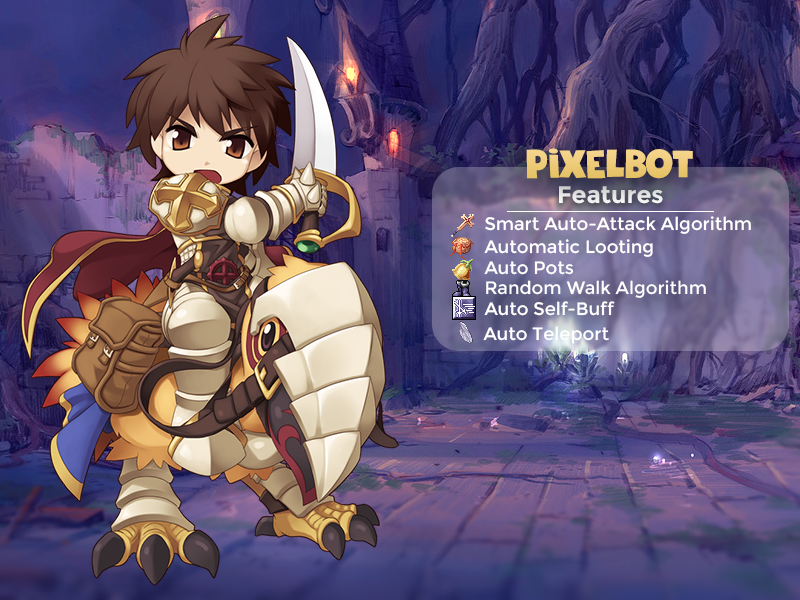

An automation tool for Ragnarok Online with Gepard Shield Protection written using Golang and GoCV.

## 🍰 Video Demo

[](http://www.youtube.com/watch?v=cx92LeBfn1s "Pixel Bot Demo Video")

## 🍯 Features

- Random Walk
- Auto Attack
- Auto Loot
- Auto Teleport
- Auto Potion
- Auto Skill
- Auto Heal
- MVP Detection
- Encrypted License Checking (AES)

## 🍠 Requirements

- Go Lang >= 1.13
  
## 🍻 Usage

Windows

```bash
go build
```

Linux
  
```bash
go build # to compile
# or
go run *.go # to run
```